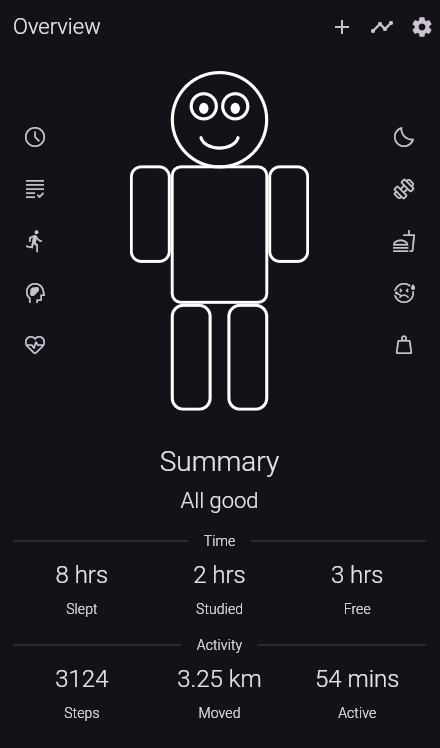
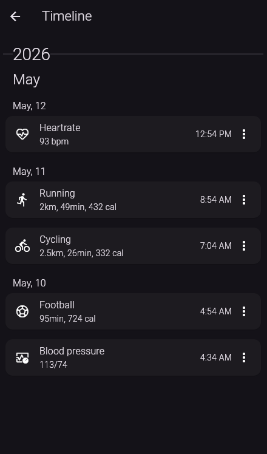

# LifeSync

## About

LifeSyncAI is a student wellness app designed to analyze lifestlye habits and their influence on academic influence on students. This app integrates manually entered data like sleep duration, physical activity, study hours and grades with AI based food recognition for calorie estimation.

Food images uploaded by user will be processed using a deep learning model trained on Food 101 dataset with backend implemented using Python and Flask.

Front end will be made using Flutter for mobile friendly cross platform data entry, visualization and interaction. AI based analysis is applied to all data to identify trends to correlate lifestyle factors and academic outcomes.

## Screenshots

    
    

## Features
- Track academics, mental health, vitals, nutrition, activities, workouts, sleep etc...
- Analyze data for each day, month, year etc... and find trends
- Get ML recommendations and trends

## Tech stack used
- Flutter + Dart
- SQLite (sqlite3)

### Libraries used
- Material Symbols Icons
- Intl

## References

1. 
Syed Khaliq, Y. Jayasurya Reddy, and Y. Sriyukth Chowdary, “Food Calorie Estimation Using Deep Learning and Computer Vision,” International Journal of Engineering Technology Research & Management (IJETRM), vol. 9, no. 4, pp. 1–3, April 2025, ISSN 2456-9348, doi:10.5281/zenodo.15119775

2. 
Amugongo LM, Kriebitz A, Boch A, Lütge C. Mobile Computer Vision-Based Applications for Food Recognition and Volume and Calorific Estimation: A Systematic Review. Healthcare (Basel). 2022 Dec 26;11(1):59. doi: 10.3390/healthcare11010059. PMID: 36611519; PMCID: PMC9818870

3. 
S. M. J. Irfan, G. Dhivya, N. Raghavendran, M. C. Babu, T. Jasperline and R. Saravanakumar, "AI Personalized Mental Health Monitoring System using Machine Learning, and Natural Language Processing," 2025 International Conference on Data Science, Agents & Artificial Intelligence (ICDSAAI), Chennai, India, 2025, pp. 1-5, doi: 10.1109/ICDSAAI65575.2025.11011535

